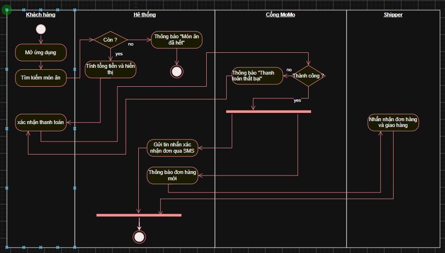
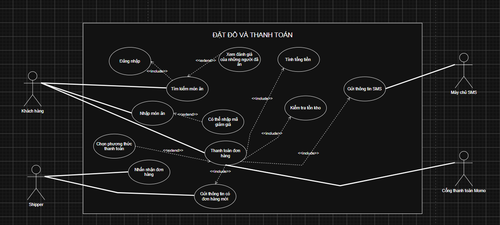

## Các thành phần của sơ đồ Activity Diagram:
1. Start node
2. End node
3. Actions node
4. Decision node
5. Join node
6. Fork node

## Nhận diện Tác nhân và Trích xuất Ca sử dụng Use Case

1. Tác nhân chính: Người dùng, Shipper
2. Tác nhân phụ: Hệ thống, cổng Momo

## Bảng 6 Ca sử dụng

| Tên Use Case                         | Tác nhân chính | Tác nhân phụ | Mô tả                                                                                                                                                                |
| ------------------------------------- | ----------------- | --------------- | ---------------------------------------------------------------------------------------------------------------------------------------------------------------------- |
| Tìm kiếm món ăn                   | Người dùng     | không          | Người dùng tìm món ăn mà người dùng muốn ăn                                                                                                                |
| Đặt đồ ăn                        | Người dùng     | Không          | Người dùng sẽ bấm nút đặt đồ ăn trên ứng dụng                                                                                                            |
| Kiểm tra tồn kho                    | Hệ thống        | Không          | Kiểm tra xem món ăn mà người dùng đặt còn không ? nếu còn thì sẽ tín tổng tiền các món còn không thì sẽ thông báo không còn món ăn đó |
| Thanh toán đơn hàng               | Người dùng     | Cổng Momo      | Khách hàng sẽ thực hiện xác nhận đơn hàng và trừ tiền vào tài khoản Momo                                                                               |
| Gửi tin nhắn đơn hàng xác nhận | Hệ thống        | Không          | Hệ thống sẽ gửi tin nhắn SMS với trạng thái của đơn hàng sẽ bắt đầu được đặt                                                                      |
| Thông báo đơn hàng               | Hệ thống        | Shipper         | Hệ thống sẽ gửi thông báo với các shipper trong bán kính gần là có một đơn hàng mới được đặt                                                    |

## Tài liệu đặc tả User Case chi tiết

| Các tiêu chí            | Nội dung                                                                                                                                                                                                                                                                                                                                                                                                                                                                             |
| -------------------------- | ------------------------------------------------------------------------------------------------------------------------------------------------------------------------------------------------------------------------------------------------------------------------------------------------------------------------------------------------------------------------------------------------------------------------------------------------------------------------------------- |
| Thông tin chung           | + Mã User Case: UC-Demon036 + Tên User Case: Đặt đồ ăn và thanh toán + Actor chính: Khách hàng, Shipper + Actor phụ: Hệ thống của QuickBite, Cổng thanh toán Momo                                                                                                                                                                                                                                                                                    |
| Mô tả                    | Người dùng sẽ đặt món ăn và hệ thống sẽ xem có còn món ăn đó không nếu còn thì sẽ cho người dùng thanh toán tổng tiền các món đó và gửi xác nhận qua tin nhắn SMS                                                                                                                                                                                                                                                                              |
| Tiền điều kiện         | Đã đăng nhập, có số điện thoại và địa chỉ trước khi đặt đơn hàng                                                                                                                                                                                                                                                                                                                                                                                                 |
| Hậu điều kiện          | Suôn sẻ: Thông báo người dùng đặt đơn thành công Sai: Thông báo hết món ăn, Thông báo thanh toán thất bại                                                                                                                                                                                                                                                                                                                                                 |
| Sự kiện chính           | 1. Người dùng nhập món ăn muốn tìm thấy 2. Hệ thống xem còn món ăn đó trong dữ liệu không 3. Hệ thống sẽ chuyển tổng số tiền của các món ăn rồi xác nhận thanh toán 4. Người dùng xác nhận thanh toán qua cổng thanh toán Momo 5. Hệ thống sẽ gửi tin nhắn SMS với trạng thái của đơn hàng đồng thời gửi thông báo với các Shipper là có đơn hàng mới 6. Shipper nhấn nhận đơn hàng |
| Luồng sự kiện thay thế | 1.1.  Xem đánh giá của những người ăn trước trước khi đặt đồ ăn đó 3.1. Có thể áp dụng mã giảm giá của của hàng đó 3.2. Có thể thanh toán bằng tiền mặt khi ship tận nơi hoặc ngân hàng số                                                                                                                                                                                                                                     |

